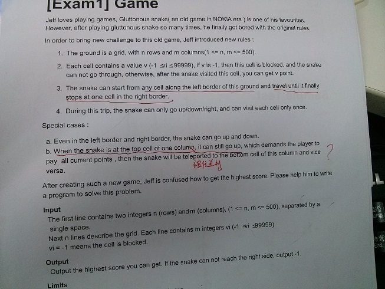
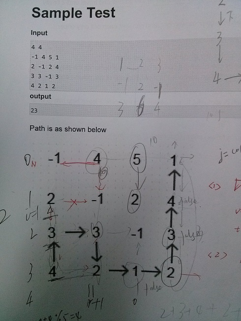
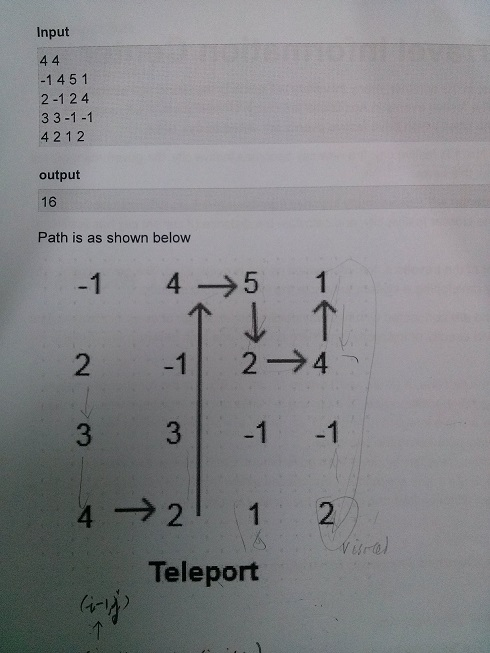
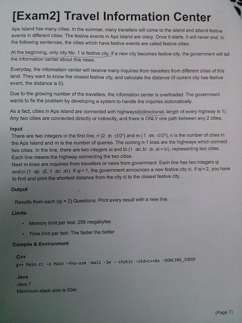
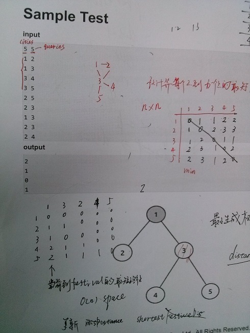
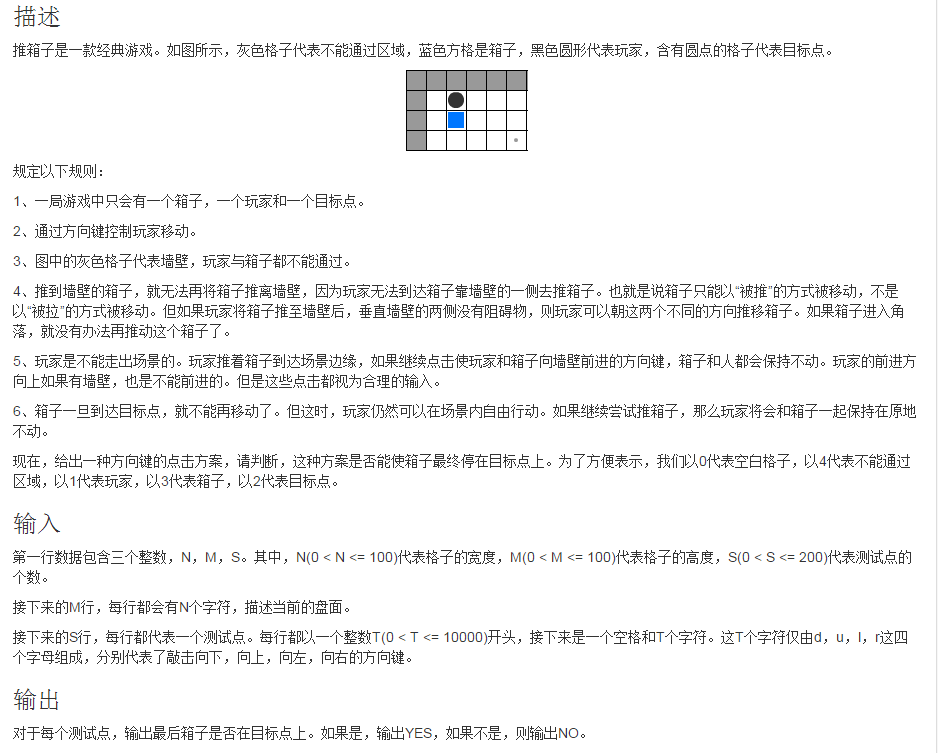
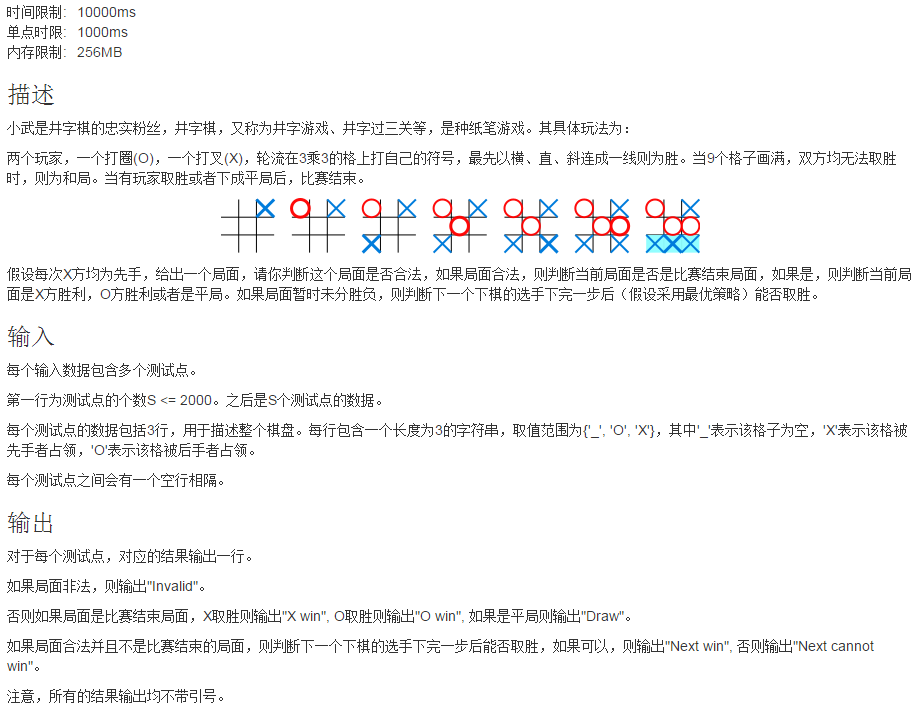

##Problem 1

##Problem 2

##Problem 3：[推箱子](http://hihocoder.com/contest/ntest2015april/problem/1)

样例输入

	5 4 3
	00000
	13000
	00200
	00000
	4 rurd
	6 urdldr
	6 rrrurd

样例输出

	YES
	YES
	 NO

##Problem 4: [井字棋](http://hihocoder.com/contest/ntest2015april/problem/2)

样例提示
	
	第一个例子，因为X先下，所以该局面不可能出现。
	第二个例子，为结束局面，X取胜。
	第三个例子，全部格子下完，双方均无法取胜，平局。
	第四个例子，局面未分胜负，下一个下的是X，可以取胜。
	第五个例子，局面未分胜负，下一个下的是O，无论下到哪一个格子均无法取胜。	

样例输入

	5
	__O
	_XO
	___
	
	XXX
	___
	OO_
	
	XXO
	OOX
	XXO
	
	X_X
	OO_
	___
	
	XO_
	XX_
	__O

样例输出

	Invalid
	X win
	Draw
	Next win
	Next cannot win

