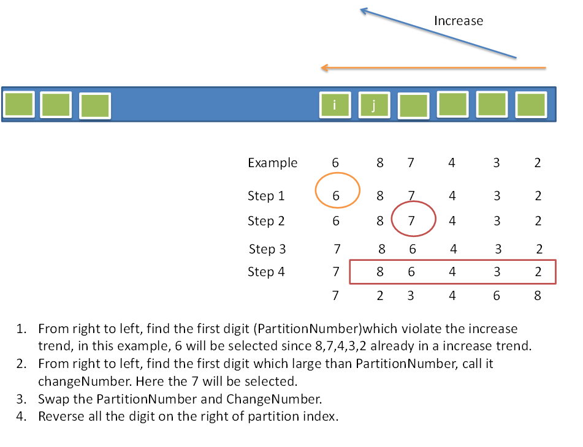

# Week 3 Problems(Tricks)
##Problem1： Next Permutation 
Implement next permutation, which rearranges numbers into the lexicographically next greater permutation of numbers.

If such arrangement is not possible, it must rearrange it as the lowest possible order (ie, sorted in ascending order).

The replacement must be in-place, do not allocate extra memory.

Here are some examples. Inputs are in the left-hand column and its corresponding outputs are in the right-hand column.

1,2,3 → 1,3,2

3,2,1 → 1,2,3

1,1,5 → 1,5,1

**解题思路**

1：先逆向找到第一个下降的数字。记录该位置用于后面置换。

2：对该数字后面的数字进行reverse

3：再从后往前找到刚好大于第一步记录数字的数字。对二者进行置换。



Code:
```
class Solution {

public:

    void nextPermutation(vector<int>& nums) {

        int length = nums.size();

        int start = length-2;

        

        while( start>=0 && nums[start] >= nums[start+1] ) start--;

        reverse( nums.begin()+1+start, nums.end() );

        if( start>=0 ) {

            int i=0;

            for(  i= length-1; i>=0 && nums[i]>nums[start]; i-- );

            swap( nums[start], nums[i+1] );

        }

    }

};

```

注意：nums.begin()+ 1 + start 和 nums.begin() + start+ 1的区别。start为-1是后面会报错。

##Problem2：Permutation Sequence 
 
The set [1,2,3,…,n] contains a total of n! unique permutations.

By listing and labeling all of the permutations in order,
We get the following sequence (ie, for n = 3):

"123"

"132"

"213"

"231"

"312"

"321"

Given n and k, return the kth permutation sequence.

Note: Given n will be between 1 and 9 inclusive.

思路：
1: 直接的想法从开始转态顺序找到第k个。直接调用上面的problem1中的程序。leetcode超时。
2：组合数的规律，每次除以 (n-1)!。然后把这个数提前。并删除这个数。对后面的数继续递归调用k-d*fac。

注意：
规律是首先要对k做一个除余k！的判断。否则后面的移动会越界。（leetcode 测试样例不够）

```
class Solution {

public:

    char int2char( int x ) {

        char val = '0';

        val += x;

        return val;

    }

    int factorial( int x) {

        if(x<=1) return 1;

        int rel=1;

        for( int i=1; i<=x; i++ ) rel*=i;

        return rel;

    }

    string Permutation(vector<int> nums, int k) {

        if(k==1){

            string ans(nums.size(), '0');

            for(int i=0; i<nums.size(); i++) ans[i] += nums[i];

            return ans;

        } 

        int fac = factorial( nums.size()-1 );

        int d = (k-1)/fac;

        int n = nums[d];

        nums.erase( nums.begin()+d );

        return int2char(n)+ Permutation( nums, k-d*fac );

    }


    string getPermutation(int n, int k) {

        vector<int> nums( n, 0 );

        for( int i=0; i<n; i++ ) nums[i] = i+1;

        k = (k-1)%factorial(n)+1;

        return Permutation( nums, k );

    }

};
```

顺序找第k个。超时程序
```
class Solution {

public:

    void nextPermutation(vector<int>& nums) {

        int len= nums.size(), start = len-2, i;

        while(start>=0 && nums[start]>=nums[start+1]) --start;

        std::reverse(nums.begin()+1 + start ,nums.end());

        if(start>=0) 

        {

            for(i=len-2; nums[i]> nums[start];--i);

            swap(nums[start], nums[i+1]);

        }

    }


    string getPermutation(int n, int k) {

        vector<int> nums( n, 0 );

        for( int i=0; i<n; i++ ) nums[i] = i+1;

        for( int i=0; i<k-1; i++ ) nextPermutation( nums );

        string result( n, '0' );

        for( int i=0; i<n; i++ ) result[i] += nums[i];

        return result;

    }

};
```

##Problem3：Ugly Number
Write a program to check whether a given number is an ugly number.

Ugly numbers are positive numbers whose prime factors only include 2, 3, 5. For example, 6, 8 are ugly while 14 is not ugly since it includes another prime factor 7.

Note that 1 is typically treated as an ugly number.

了解一个新的概念：丑数

```
class Solution {
public:

    bool isUgly(int num) {
        if( num<=0 ) return false;
        while( num%2 == 0) num/=2;
        while( num%3 == 0 ) num/=3;
        while( num%5 == 0 ) num/=5;
        if( num==1 ) return true;
        else return false;
    }
};


```

**Ugly Number II**

Write a program to find the n-th ugly number.

Ugly numbers are positive numbers whose prime factors only include 2, 3, 5. For example, 1, 2, 3, 4, 5, 6, 8, 9, 10, 12 is the sequence of the first 10 ugly numbers.

Note that 1 is typically treated as an ugly number.

```

class Solution {

public:

    int nthUglyNumber(int n) {
        if(n<1) return 0;
        vector<int> uglyNum( n,0 );
        uglyNum[0] = 1;
        int idx2,idx3,idx5;
        idx2=idx3=idx5=0;
        int idx=0;
        while(idx<n){
            while( uglyNum[idx2]*2<= uglyNum[idx] ) idx2++;
            while( uglyNum[idx3]*3<= uglyNum[idx] ) idx3++;
            while( uglyNum[idx5]*5<= uglyNum[idx] ) idx5++;
            int val = min(min( uglyNum[idx2]*2,uglyNum[idx3]*3), uglyNum[idx5]*5);
            idx++;
            if(idx>=n) break;
            uglyNum[idx] = val;
        }
        return uglyNum[n-1];
    }
};
```

##Problem4：Kth Smallest Element in a BST 

Given a binary search tree, write a function kthSmallest to find the kth smallest element in it.

Note: 
You may assume k is always valid, 1 ≤ k ≤ BST's total elements.

What if the BST is modified (insert/delete operations) often and you need to find the kth smallest frequently? How would you optimize the kthSmallest routine?

思路：
1：中序遍历，把k个最小node的指针压入vector；
2：当vector大小为k个时候。设置指示变量。后面不在遍历。直接退出。
3：把结果放到参数里。（感觉更简单点）


```c++


class Solution {

public:

    void findKthSamllest( TreeNode* root,const int k, vector< TreeNode *> & ptrVec, bool &flag, int & tar ) {
        if(flag==true) return;
        if( root != NULL ) {
            findKthSamllest( root->left, k, ptrVec, flag, tar );
            ptrVec.push_back( root );
            if( ptrVec.size() == k ) {
                tar = root->val;
                flag  = true;
                return;
            }
            findKthSamllest( root->right, k, ptrVec, flag, tar );
        }
    }

    int kthSmallest(TreeNode* root, int k) {
        vector< TreeNode *> ptrVec;
        bool flag = false;
        int tar = 0;
        findKthSamllest( root, k, ptrVec, flag, tar );
        return tar;
    }
};
```
