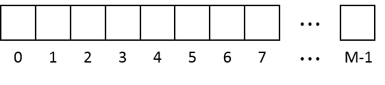
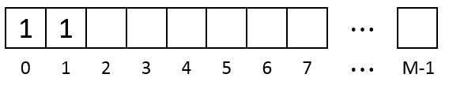
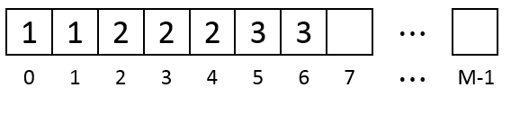
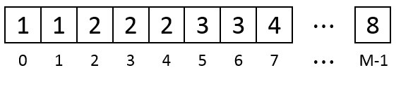
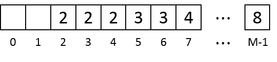
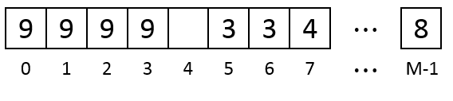

# Problems

## [Candy](https://leetcode.com/problems/candy/)

### Problem
There are N children standing in a line. Each child is assigned a rating value.
You are giving candies to these children subjected to the following requirements:
Each child must have at least one candy.
Children with a higher rating get more candies than their neighbors.
What is the minimum candies you must give?

### Solution
分别从0到N-1和N-1到0计算上升子序列的长度， 然后计算当前位置的最大值。

example： 
```
              1 3 2 1 5 1
left2right -> 1 2 1 1 2 1
right2left -> 1 3 2 1 2 1
answer     -> 1 3 2 1 2 1
```
### Code
```c++
class Solution {
public:
    int candy(vector<int>& ratings) {
        int N = ratings.size();
        vector<int> left(N, 1);
        vector<int> right(N, 1);
        
        for(int i = 1;i < N;i++) {
            left[i] = ratings[i] > ratings[i - 1] ? left[i - 1] + 1 : left[i];
            right[N - 1 - i] = ratings[N - 1 - i] > ratings[N - i] ? right[N - i] + 1 : right[N - 1 - i];
        }
        
        int count = 0;
        for(int i = 0;i < N;i++) {
            count += max(left[i], right[i]);
        }
        return count;
    }
```
## [Search a 2D Matrix II](https://leetcode.com/problems/search-a-2d-matrix-ii/)

### Problem
Write an efficient algorithm that searches for a value in an m x n matrix. This matrix has the following properties:

Integers in each row are sorted in ascending from left to right.
Integers in each column are sorted in ascending from top to bottom.
For example,

Consider the following matrix:
```
[
  [1,   4,  7, 11, 15],
  [2,   5,  8, 12, 19],
  [3,   6,  9, 16, 22],
  [10, 13, 14, 17, 24],
  [18, 21, 23, 26, 30]
]
```
Given target = 5, return true.
Given target = 20, return false.

### Code
二分搜索 log(M) + Mlog(N)
```c++
    class Solution {
public:
    bool searchMatrix(vector<vector<int>>& matrix, int target) {
        int H, W;
        H = matrix.size();
        if(!H) return false;
        W = matrix[0].size();
        if(!W) return false;
        
        int left = 0, right = H - 1;
        while(left <= right) {
            int mid = left + (right - left) / 2;
            if(matrix[mid][0] == target) return true;
            else if(matrix[mid][0] > target) {
                right = mid - 1;
            } else {
                left = mid + 1;
            }
        }
        int mark = left;
        for(int i = 0;i < mark;i++) {
            vector<int> &line = matrix[i];
            left = 0, right = W - 1;
            while(left <= right) {
                int mid = left + (right - left) / 2;
                if(line[mid] == target) return true;
                else if(line[mid] > target) {
                    right = mid - 1;
                } else {
                    left = mid +1;
                }
            }
            
        }
        return false;
    }  
};
```
分治法 O(M + N)
```c++
class Solution {
public:
    bool searchMatrix(vector<vector<int>>& matrix, int target) {
        int H, W;
        H = matrix.size();
        if(!H) return false;
        W = matrix[0].size();
        if(!W) return false;
        
        int y = 0, x = W - 1;
        while(y < H && x >= 0) {
            int v = matrix[y][x];
            if(v == target) return true;
            else if(v < target) y++;
            else x--;
        }
        return false;
    }  
};
```

## [Different Ways to Add Parentheses](https://leetcode.com/problems/different-ways-to-add-parentheses/)

### Problem
Given a string of numbers and operators, return all possible results from computing all the different possible ways to group numbers and operators. The valid operators are +, - and *.


Example 1
Input: "2-1-1".
```
((2-1)-1) = 0
(2-(1-1)) = 2
Output: [0, 2]
```

Example 2
Input: `2 * 3 - 4 * 5`
```
(2*(3-(4*5))) = -34
((2*3)-(4*5)) = -14
((2*(3-4))*5) = -10
(2*((3-4)*5)) = -10
(((2*3)-4)*5) = 10
Output: [-34, -14, -10, -10, 10]
```

### CODE
分治+DP
```c++
class Solution {
    unordered_map<unsigned int, vector<int>> cache;
    string tokens;
public:
    vector<int> diffWaysToCompute(string input) {       
        cache.clear();
        tokens = input;
        dp(0, tokens.size() - 1);   
        return cache[tokens.size() - 1];
    }

    void dp(int start, int end) {
        unsigned int code = (start << 16) + end;
        if (cache.count(code)) return;

        vector<int> res;
        for (int idx = start; idx <= end; idx++) {
            if (!isdigit(tokens[idx])) {
                char op = tokens[idx];
                dp(start, idx - 1);
                dp(idx + 1, end);
                int code_left = (start << 16) + idx - 1;
                int code_right = ((idx + 1) << 16) + end;
                vector<int> &left = cache [code_left];
                vector<int> &right = cache [code_right];
                for (int l : left) {
                    for (int r : right) {
                        switch (op)
                        {
                        case '+': res.push_back(l + r); break;
                        case '-': res.push_back(l - r); break;
                        case '*': res.push_back(l * r); break;
                        default:
                            break;
                        }
                    }
                }
            }
        }
        
        if(res.empty()) {
            res.push_back(atoi(tokens.substr(start, end - start + 1).c_str())); 
        }
        cache[code] = res;
    }
};
```


## [Expression Add Operators](https://leetcode.com/problems/expression-add-operators/)

### Problem
Given a string that contains only digits 0-9 and a target value, return all possibilities to add binary operators (not unary) +, -, or * between the digits so they evaluate to the target value.

Examples: 
```
"123", 6 -> ["1+2+3", "1*2*3"] 
"232", 8 -> ["2*3+2", "2+3*2"]
"105", 5 -> ["1*0+5","10-5"]
"00", 0 -> ["0+0", "0-0", "0*0"]
"3456237490", 9191 -> []
```

### CODE
DFS
```c++
class Solution {
	vector<string> global_res;
public:
	vector<string> addOperators(string num, int target) {
		global_res.clear();
		dfs(num, target, "", 0, 0, 0);
		return global_res;
	}

	void dfs(string &num, int target, string cur_exp, int pos, long long last_res, long long last_num) {
		if (pos >= num.size()) {
			if (last_res == target)	global_res.push_back(cur_exp);
			return;
		}

		for (int idx = pos; idx < num.size(); idx++) {
			if (idx != pos && num[pos] == '0') break;
			string subnum = num.substr(pos, idx - pos + 1);
			long long v = stoll(subnum.c_str());
			
			if (0 == pos) {
				dfs(num, target, subnum, idx + 1, last_res + v, v);
			}
			else {
				dfs(num, target, cur_exp + "+" + subnum, idx + 1, last_res + v, v);
				dfs(num, target, cur_exp + "-" + subnum, idx + 1, last_res - v, -v);
				dfs(num, target, cur_exp + "*" + subnum, idx + 1,
					last_res - last_num + v * last_num, v * last_num);
				
			}
		}		
	}	
};
```

## [Perfect Squares](https://leetcode.com/problems/perfect-squares/)

### Problem
Given a positive integer n, find the least number of perfect square numbers (for example, 1, 4, 9, 16, ...) which sum to n.

For example, given `n = 12`, return 3 because `12 = 4 + 4 + 4`; given n = 13, return 2 because `13 = 4 + 9`.

### CODE
#### 数论

四平方和定理 （英语：Lagrange's four-square theorem） 说明每个正整数均可表示为4个整数的平方和。它是费马多边形数定理和华林问题的特例。
Adrien-Marie Legendre证明：
### A positive integer can be expressed as the sum of three squares if and only if it is not of the form 4^k(8m+7), 其中k和m是整数

```c++
int numSquares(int n) {
    while (n % 4 == 0)
        n /= 4;
    if (n % 8 == 7)
        return 4;
    for (int a=0; a*a<=n; ++a) {
        int b = sqrt(n - a*a);
        if (a*a + b*b == n)
            return !!a + !!b;
    }
    return 3;
}
```

#### DP

```c++
class Solution {
public:
	int numSquares(int n) {
		vector<int> dp(1, 0);
		while (dp.size() <= n) {
			int m = dp.size(), val = INT_MAX;
			for (int i = 1; i * i <= m; ++i) {
				val = min(val, dp[m - i * i] + 1);
			}
			dp.push_back(val);
		}
		return dp.back();
	}
};
```

#### BFS
```c++
class Solution {
	unordered_set<int> cache;
public:
	int numSquares(int n) {		
		cache.clear();

		queue<int> q[2];
		bool success = false;
		int cur = 0, depth = 1;		
		q[cur].push(n);
		cache.insert(n);
		while (!q[cur].empty()) {
			int sum = q[cur].front(); q[cur].pop();
			for (int idx = (int) sqrt(double(sum)); idx >= 1; idx--) {
				int tail = sum - idx * idx;
				if (0 == tail) {
					success = true; break;
				}
				if (cache.count(tail)) continue;
				cache.insert(tail);
				q[1 - cur].push(tail);
			}

			if (success) break;
			if (q[cur].empty()) {
				cur = 1 - cur;	
				depth++;
			}
		}

		return depth;
	}
};
```

## [Peeking Iterator](https://leetcode.com/problems/peeking-iterator/)

### Program
Given an Iterator class interface with methods: next() and hasNext(), design and implement a PeekingIterator that support the peek() operation -- it essentially peek() at the element that will be returned by the next call to next().

### CODE
```c++
// Below is the interface for Iterator, which is already defined for you.
// **DO NOT** modify the interface for Iterator.
class Iterator {
    struct Data;
	Data* data;
public:
	Iterator(const vector<int>& nums);
	Iterator(const Iterator& iter);
	virtual ~Iterator();
	// Returns the next element in the iteration.
	int next();
	// Returns true if the iteration has more elements.
	bool hasNext() const;
};


class PeekingIterator : public Iterator {
    bool picked;
    int cache;
public:
	PeekingIterator(const vector<int>& nums) : Iterator(nums) {	    
	    picked = false;
	}

    // Returns the next element in the iteration without advancing the iterator.
	int peek() {
        if(!picked) {
            cache = Iterator::next();
            picked = true;
        }
        return cache;
	}

	// hasNext() and next() should behave the same as in the Iterator interface.
	// Override them if needed.
	int next() {
	   if(!picked) {
	       return Iterator::next();
	   } else {
	       picked = false;
	       return cache;
	   }
	}

	bool hasNext() const {
	    return picked || Iterator::hasNext();
	}
};
```

# DISCUSS

## Memory Allocating Algorithm

时间限制:10000ms
单点时限:1000ms
内存限制:256MB
描述
Little Hi is studying on memory allocating algorithms this summer. He starts his experiments with a very simple algorithm. By this algorithm memory is considered as a sequence of M consecutive storage units, numbered from 0 to M-1.



Whenever a piece of data is written to the memory the algorithm finds from 0 to M-1 the first segment of consecutive empty units which is large enough and save the data there. For example if the data size is 2 after saving it the memory look as below. Units are marked as 1 because they contain the 1st data we write.



If we continue to write two pieces of data of size 3 and 2 the memory looks like below. Units 2-4 contain the 2nd data and Units 5 and 6 contain the 3rd data.



If there is not enough consecutive empty units for the coming data the algorithm will keep removing the earliest data until the coming data can be saved. Assume the memory if full after we write the 8th data:



And we need to write the 9th data of size 4. The algorithm removes the 1st data:



There is still not enough consecutive empty units so the 2nd data is also removed. Then the 9th data is saved at Units 0-3:



Remember if there are multiple possible segments to save the coming data the algorithm always choose the segment which is started at the unit of the smallest number.

After writing N data of different sizes Little Hi wants to know what the memory looks like.

输入
Line 1: N and M, the number of data and the size of the memory.

Line 2: N integers, K1, K2 …, KN. Ki is the size of the ith data.

For 60% of the data 1≤N≤200，10≤M≤100，1≤Ki≤5

For 100% of the data 1≤N≤2,000，10≤M≤109，1≤Ki≤M

输出
For each data which is still in the memory at last output one line of two integers id and s: the number of the data and its starting position in the memory. Output them in increasing order of id.

样例提示
The memory looks after saving each data:
```
1 1 1 1 1 0 0 0 0 0
1 1 1 1 1 2 2 0 0 0
1 1 1 1 1 2 2 3 3 0
4 4 0 0 0 2 2 3 3 0
4 4 5 5 5 5 0 3 3 0
4 4 5 5 5 5 6 6 6 6
```
样例输入
```
6 10
5 2 2 2 4 4
```
样例输出
```
4 0
5 2
6 6
```

## Knight
有一个N * M大小的棋盘和一个骑士， 骑士可以选择L(1<=L<=10)种不同的移动方式。对于第i种移动，它可以从当前位置(x, y)跳到新位置(x+dx[i], y+dy[i]), 如果新的位置没有超出棋盘边界，那么这次移动就是合法的。如果骑士在某个位置可以刚好执行k种不同的合法移动，则定义这个位置为k-valid-position, 求棋盘上一共多少个k-valid-position.
题目说明 "N对应x方向， M对应y方向"

输入
```
第一行 N， M， L， K
接下来L行， 表示 dx[i], dy[i]
```
输出
```
k-valid-position的数目
```

样例输入
3 3 4 2

1 1

1 -1

-1 1

-1 -1

```
oox xxx xoo xxx
oox oox xoo xoo
xxx oox xxx xoo
```
样例输出
4

```
#include <iostream>
#include <cstdio>
#include <algorithm>
#include <vector>
using namespace std;
int N, M, L, K;
struct Rectangle {
	long long minY, maxY, minX, maxX;

	Rectangle(long long minY_ = 0, long long maxY_ = 1, long long minX_ = 0, long long maxX_ = 1) {
		minY = minY_; maxY = maxY_; minX = minX_; maxX = maxX_;
	}

	void set(long long minY_ = 0, long long maxY_ = 1, long long minX_ = 0, long long maxX_ = 1) {
		minY = minY_; maxY = maxY_; minX = minX_; maxX = maxX_;
	}

	bool legal() const {
		return minY <= maxY && minX <= maxX;
	}

	long long area() const {
		return (maxY - minY + 1) * (maxX - minX + 1);
	}

	bool PointIn(long long x, long long y) const {
		return x >= minX && x <= maxX && y <= maxY && y >= minY;
	}
};

bool Intersection(Rectangle const &rect1, Rectangle const &rect2) {
	return rect1.PointIn(rect2.minX, rect2.minY)
		|| rect2.PointIn(rect1.minX, rect1.minY)
		|| rect1.PointIn(rect2.maxX, rect2.maxY)
		|| rect2.PointIn(rect1.maxX, rect1.maxY)
		|| rect1.PointIn(rect2.minX, rect2.maxY)
		|| rect2.PointIn(rect1.minX, rect1.maxY)
		|| rect1.PointIn(rect2.maxX, rect2.minY)
		|| rect2.PointIn(rect1.maxX, rect1.minY);
}

// rect2 in rect1?
bool contain(Rectangle const &rect1, Rectangle const &rect2) {
	return rect2.minY >= rect1.minY && rect2.maxY <= rect1.maxY && rect2.minX >= rect1.minX && rect2.maxX <= rect1.maxX;
}

Rectangle IntersectionRect(Rectangle const &rect1, Rectangle const &rect2) {
	Rectangle res;
	res.minY = max(rect1.minY, rect2.minY);
	res.maxY = min(rect1.maxY, rect2.maxY);
	res.minX = max(rect1.minX, rect2.minX);
	res.maxX = min(rect1.maxX, rect2.maxX);

	return res;
}

//A - B
vector<Rectangle> RectangeDiff(Rectangle r, Rectangle s) {
	vector<Rectangle> res, res1;
	if (!Intersection(r, s)) {
		res.push_back(r); 
		return res;
	}

	if (contain(s, r)) {
		return res;
	}

	long long a = min(r.minX, s.minX);
	long long b = max(r.minX, s.minX);
	long long c = min(r.maxX, s.maxX);
	long long d = max(r.maxX, s.maxX);

	long long e = min(r.minY, s.minY);
	long long f = max(r.minY, s.minY);
	long long g = min(r.maxY, s.maxY);
	long long h = max(r.maxY, s.maxY);

	// X = intersection, 0-7 = possible difference areas
	// h +-+-+-+
	// . |5|6|7|
	// g +-+-+-+
	// . |3|X|4|
	// f +-+-+-+
	// . |0|1|2|
	// e +-+-+-+
	// . a b c d
	
	// we'll always have rectangles 1, 3, 4 and 6
	res.push_back(Rectangle(b, c, e, f - 1));
	res.push_back(Rectangle(a, b - 1, f, g));
	res.push_back(Rectangle(c + 1, d, f, g));
	res.push_back(Rectangle(b, c, g + 1, h));

	if (contain(r, s)) {
		res.push_back(Rectangle(a, b, e, f - 1));
		res.push_back(Rectangle(c, d, g + 1, h));
		res.push_back(Rectangle(c + 1, d, e, f));
		res.push_back(Rectangle(a, b - 1, g, h));
	}
	else {
		// decide which corners
		if (r.minX == a && r.minY == e || s.minX == a && s.minY == e)
		{ // corners 0 and 7
			res.push_back(Rectangle(a, b, e, f - 1));
			res.push_back(Rectangle(c, d, g + 1, h));
		}
		else
		{ // corners 2 and 5
			res.push_back(Rectangle(c + 1, d, e, f));
			res.push_back(Rectangle(a, b - 1, g, h));
		}
	}

	for (auto v : res) {
		if (v.legal() && contain(r, v)) {
			res1.push_back(v);
		}
	}
	return res1;
}

vector<Rectangle> RectangeDiff(vector<Rectangle> rects, Rectangle one) {
	vector<Rectangle> res;
	for (int idx = 0; idx < rects.size(); idx++) {
		vector<Rectangle> subres = RectangeDiff(rects[idx], one);
		for (int jdx = 0; jdx < subres.size(); jdx++) {
			res.push_back(subres[jdx]);
		}
	}
	return res;
}

int main() {
	while (scanf("%d%d%d%d", &N, &M, &L, &K) != EOF){
		vector<Rectangle> rects;
		vector<bool> good(L, true);
		int rect_count = 0;
		for (int idx = 0; idx < L; idx++) {
			int dx, dy;
			scanf("%d%d", &dx, &dy);
			Rectangle rect;
			rect.minX = max(0, -dx);
			rect.maxX = min(N - 1, N - dx - 1);
			rect.minY = max(0, -dy);
			rect.maxY = min(M - 1, M - dy - 1);
			if (!(rect.minX > rect.maxX || rect.maxY < rect.minY)) {
				rect_count++;
			}
			else {
				good[idx] = false;
			}
			rects.push_back(rect);
		}

		if (rect_count < K) {
			printf("0\n");
			continue;
		}

		long long sum = 0;
		char flags[11];
		memset(flags, '0', sizeof(flags));
		for (int idx = 0; idx < K; idx++) flags[L - 1 - idx] = '1';
		vector<Rectangle> inter_rects;
		do {
			Rectangle inter;
			long long area = 0;
			inter.minY = 0; inter.minX = 0; inter.maxY = M - 1; inter.maxX = N - 1;
			for (int idx = 0; idx < L; idx++) {
				if (flags[idx] == '0') continue;
				if (!good[idx] || !Intersection(inter, rects[idx])) {
					area = 0; break;
				}				
				Rectangle subrect = IntersectionRect(inter, rects[idx]);
				area = subrect.area();
				inter = subrect;
			}

			if (!area) 	continue;
			vector<Rectangle> pieces = { inter };
			for (int idx = 0; idx < L; idx++) {
				if (flags[idx] == '1') continue;
				pieces = RectangeDiff(pieces, rects[idx]);
			}

			for (auto rect : pieces) {
				sum += rect.area();
			}
			
		} while (next_permutation(flags, flags + L));

		cout << sum << endl;		
	}
	return 0;
}

```


