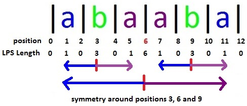
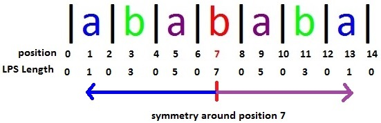
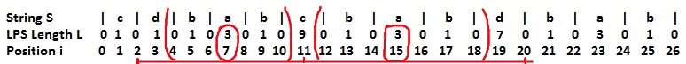
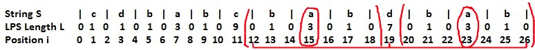
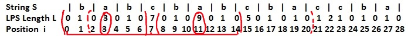
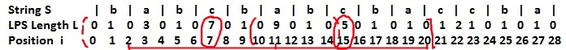

#Week 3 Problems(string)

## Manacher’s Algorithm – Linear Time Longest Palindromic Substring

* LPS长度在奇数位置一定是奇数且>=1
* LPS长度在偶数位置一定是偶数且>=0
* position的范围是0~2N，index的范围是0~N-1
* 对于长度为d的回文，position[i-d:i+d]为回文子串
* 对于长度为d的回文，index[(i-d)/2:(i+d)/2-1]为回文子串 

### 字符串abaaba


* 以position**3**为中心，position**2**和**4**的LPS长度相同， position**1**和**4**的LPS长度相同
* 以position**6**为中心，position**5**和**7**的LPS长度相同， position**4**和**8**的LPS长度相同

对于position**6**, 如果已知position**1**，**2**，**3**，**4**，**5**， **6**的LPS长度， 就没有必要计算**7**，**8**，**9**，**10**，**11**的LPS长度

### 字符串abababa


对于position**7**, 如果已知position**1**，**2**，**3**，**4**，**5**， **6**， **7**的LPS长度， 就没有必要计算**8**，**9**，**10**，**11**， **12**， **13**的LPS长度

**然而**， 对于position**3**和**11**，它两侧的LPS长度并**不对称**。

如何有效地识别这种不对称并加速计算呢？

* **若L[currentLeftPosition] < centerRightPosition – currentRightPosition， 则L[currentRightPosition] = L[currentLeftPosition]**。 这条规则表示子回文串不是大回文串的前缀， 该子回文串完全包含在大回文串内部

例子：

中心位置是11的时候，centerLeftPos是2，centerRightPos是20。考虑currentRightPosition为15的情况。

<br>
* **若centerRightPosition处于输入串的末尾，且L[currentLeftPosition] == centerRightPosition – currentRightPosition**。这条规则表示大回文串是输入串的后缀且子回文串是大回文串的前缀

例子：

中心位置是19的时候，centerLeftPos是12，centerRightPos是26。考虑currentRightPosition为23的情况。

**在以上两种情况下， 右回文串不会比左回文串更长，所以右回文串长度和左回文串长度相同。**
<br>

* **若L[currentLeftPosition] == centerRightPosition – currentRightPosition但centerRightPosition不在输入串的末尾**，那么子回文串是有可能发生扩展的，且长度至少为L[currentLeftPosition]
例子：

中心位置是7的时候，centerLeftPos是0，centerRightPos是14。考虑currentRightPosition为11的情况。

<br>

*  **若L[currentLeftPosition] > centerRightPosition – currentRightPosition但centerRightPosition不在输入串的末尾**，那么子回文串是有可能发生扩展的，且长度至少为centerRightPosition – currentRightPosition

例子：

中心位置是7的时候，centerLeftPos是0，centerRightPos是14。考虑currentRightPosition为15的情况。

* 如果当前position需要扩展，那么就比较两边对称的字符是否一致。如果扩展的范围超过了centerRightPosition，那么当前的currentRightPosition就作为新的centerPosition。

```c++
diff = R - curRight;

if (L[curLeft] < diff) {
	L[curRight] = L[curLeft];
}
else if (L[curLeft] == diff && R == 2 * N) {
	L[curRight] = L[curLeft];
}
else if (L[curLeft] == diff) {
	L[curRight] = L[curLeft];
}
else if (L[curLeft] > diff) {
	L[curRight] = diff;
}

==> L[curRight] = std::min(L[curLeft], diff);

``` 

```c++
class Solution {
public:
	string longestPalindrome(string s) {
		int len = s.length();
		if (!len) return "";
		
		int M = 2 * len + 1;
		vector<int> L(M, 0);

		L[1] = 1;
		int C = 1, R = 2, curLeft, maxLPSLength = 1, maxLPSCenterPosition = 1, diff;

		for (int curRight = 2; curRight < M; curRight++) {
			curLeft = 2 * C - curRight;
			diff = R - curRight;
			if (diff > 0) {
				L[curRight] = std::min(L[curLeft], diff);
			}	
			
			int nextRight = curRight + (L[curRight] + 1);
			int nextLeft = curRight - (L[curRight] + 1);
			while (nextRight < M && nextLeft >= 0 &&
				((nextRight % 2 == 0 || s[nextRight / 2] == s[nextLeft / 2]))) {
				L[curRight]++; 
                nextRight++;
				nextLeft--;
			}			

			if (L[curRight] > maxLPSLength) {
				maxLPSLength = L[curRight];
				maxLPSCenterPosition = curRight;
			}

			if (curRight + L[curRight] > R) {
				C = curRight;
				R = C + L [curRight];
			}
		}

		return s.substr((maxLPSCenterPosition - maxLPSLength) / 2, maxLPSLength);		
	}
};
```