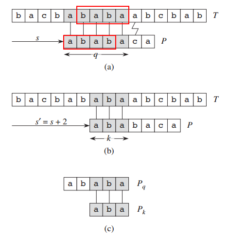
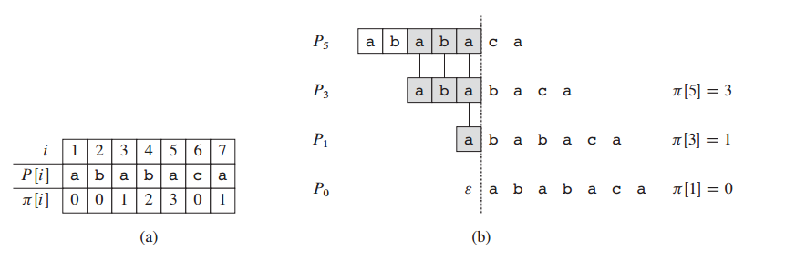
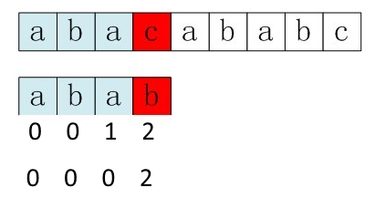
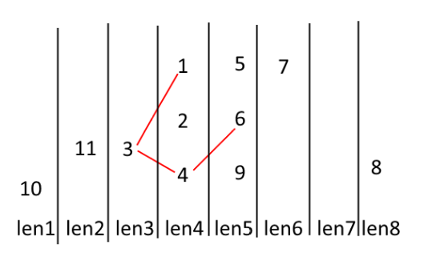
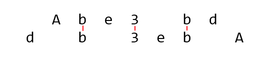

# Week 3 Problems(string)


## Problem1: [Integer Inquiry](http://poj.org/problem?id=1503)
### Description

One of the first users of BIT's new supercomputer was Chip Diller. He extended his exploration of powers of 3 to go from 0 to 333 and he explored taking various sums of those numbers. 
\`\`This supercomputer is great,'' remarked Chip. \`\`I only wish Timothy were here to see these results.'' (Chip moved to a new apartment, once one became available on the third floor of the Lemon Sky apartments on Third Street.) 

### Input

The input will consist of at most 100 lines of text, each of which contains a single VeryLongInteger. Each VeryLongInteger will be 100 or fewer characters in length, and will only contain digits (no VeryLongInteger will be negative). 

The final input line will contain a single zero on a line by itself. 
Output

Your program should output the sum of the VeryLongIntegers given in the input.

### Sample Input
	123456789012345678901234567890
	123456789012345678901234567890
	123456789012345678901234567890
	0

### Sample Output

	370370367037037036703703703670

### 思路
这个属于高精度计算的题目，缓存结果时可以反转存储，便于进位。

### CODE
```c++
int main() {
	char res[200];
	memset(res, '0', sizeof(res));
	int len_sum = 0;
	string value;
	while (cin >> value && value != string("0")) {
		char *sum = res;
		
		for (int idx = value.length() - 1; idx >= 0; idx--, sum++) {
			*sum += value[idx] - '0';

            //循环处理进位
			int jdx = 0;
			while (sum[jdx] - '0' > 9) {
				sum[jdx + 1] += (sum[jdx] - '0') / 10;
				sum[jdx] = (sum[jdx] - '0') % 10 + '0';
				jdx++;
			}
		}
	}

	//由后往前从第一个非0字符输出
	int idx = 200;
	while (res[--idx] == '0');
	while (idx >= 0) putchar(res[idx--]);

	return 0;
}
```


## Problem2: [Oulipo](http://poj.org/problem?id=3461)

### Description

The French author Georges Perec (1936–1982) once wrote a book, La disparition, without the letter 'e'. He was a member of the Oulipo group. A quote from the book:

Tout avait Pair normal, mais tout s’affirmait faux. Tout avait Fair normal, d’abord, puis surgissait l’inhumain, l’affolant. Il aurait voulu savoir où s’articulait l’association qui l’unissait au roman : stir son tapis, assaillant à tout instant son imagination, l’intuition d’un tabou, la vision d’un mal obscur, d’un quoi vacant, d’un non-dit : la vision, l’avision d’un oubli commandant tout, où s’abolissait la raison : tout avait l’air normal mais…

Perec would probably have scored high (or rather, low) in the following contest. People are asked to write a perhaps even meaningful text on some subject with as few occurrences of a given “word” as possible. Our task is to provide the jury with a program that counts these occurrences, in order to obtain a ranking of the competitors. These competitors often write very long texts with nonsense meaning; a sequence of 500,000 consecutive 'T's is not unusual. And they never use spaces.

So we want to quickly find out how often a word, i.e., a given string, occurs in a text. More formally: given the alphabet {'A', 'B', 'C', …, 'Z'} and two finite strings over that alphabet, a word W and a text T, count the number of occurrences of W in T. All the consecutive characters of W must exactly match consecutive characters of T. Occurrences may overlap.

### Input

The first line of the input file contains a single number: the number of test cases to follow. Each test case has the following format:

* One line with the word W, a string over {'A', 'B', 'C', …, 'Z'}, with 1 ≤ |W| ≤ 10,000 (here |W| denotes the length of the string W).
* One line with the text T, a string over {'A', 'B', 'C', …, 'Z'}, with |W| ≤ |T| ≤ 1,000,000.
Output

For every test case in the input file, the output should contain a single number, on a single line: the number of occurrences of the word W in the text T.

### Sample Input

```
3
BAPC
BAPC
AZA
AZAZAZA
VERDI
AVERDXIVYERDIAN
```

### Sample Output
```
1
3
0
```

### 思路
这道题是标准的字符串匹配问题，主要用KMP, Boyer–Moore等算法，不过这道题BM算法听说会超时。。。
如何理解KMP？

假设在s偏移处进行匹配，已知有q个字符与文本串匹配，但在q+1处发生失配。
从已有的匹配中可知，s+1偏移处的匹配肯定是失配的，因为T中已匹配的后缀**baba**与q的前缀**abab**并不匹配。所以，如果能找到匹配P_q后缀的最长前缀，则可以快速找到有效的位移进行下一步的匹配。


KMP在匹配之前要计算一个前缀函数π, π[p]记录了P_q的真后缀的最长前缀，如图(a)所示。

在发生失配时，可以依次尝试更短的最长前缀进行匹配，P5->P3->P1->P0，意味着模式串依次右移。
P3是P5后缀中的最长前缀，但P1和P0同样是P5的后缀。

### CODE
```c++
char word [10005];
char text [1000005];
int nexts [10005];
int word_len, text_len;

//word[1....N]
//text[1....M]

void get_nexts() {
	nexts[1] = 0;	//长度为1的字符串最长前缀长度为0
	int k = 0;		//已有的最长前缀长度为0
	for (int idx = 2; idx <= word_len; idx++) {
 		//如果已经有匹配的前缀且下一个字母和文本串当前字母不匹配
		while (k > 0 && word[idx] != word[k + 1]) {
			k = nexts [k];	//缩减到下一个最长前缀
		}
		if (word[idx] == word[k + 1]) {
			k++;
		}
		nexts[idx] = k;
	}
}

int kmp() {
	int count = 0;
	int prefix = 0; //已经匹配的前缀的长度
	get_nexts();
	for (int idx = 1; idx <= text_len; idx++) {
		while (prefix > 0 && text[idx] != word[prefix + 1]) {
			prefix = nexts[prefix]; //若发生失配，切换到当前后缀的最长前缀
		}
		if (text[idx] == word[prefix + 1]) {
			prefix++;
		}
		if (prefix == word_len) {
			count++;
			prefix = nexts[prefix];
		}
	}
	return count;
}


int main() {
	int N;
	scanf("%d", &N);
	while (N--) {
		scanf("%s", word + 1);
		scanf("%s", text + 1);
		word_len = strlen(word + 1);
		text_len = strlen(text + 1);
		printf("%d\n", kmp());
	}

	return 0;
}
```

### KMP的优化


在文本串的c位置发生失配时，按照前缀函数π，最长前缀的长度1（[a]bab），下一次与c匹配的字母仍然是b，这明显是一种失配的情况。如果模式串的p位置字符与π[p-1]+1处的字符相同，则p位置失配时，π[p-1]+1一定会失配，所以对于p-1位置要递归地求π[π[p-1]]。


```c++
void get_nexts() {
	nexts[0] = 0;
	nexts[1] = 0;	//长度为1的字符串最长前缀长度为0
	int k = 0;		//已有的最长前缀长度为0
	for (int idx = 2; idx <= word_len; idx++) {
		if (word[idx] == word[k + 1]) {
			nexts[idx - 1] = nexts [k];
		}
 		//如果已经有匹配的前缀且下一个字母和文本串当前字母不匹配
		while (k > 0 && word[idx] != word[k + 1]) {
			k = nexts [k];	//缩减到下一个最长前缀
		}
		if (word[idx] == word[k + 1]) {
			k++;
		}
		nexts[idx] = k;
	}
}
```

## POJ1226
### Description

You are given a number of case-sensitive strings of alphabetic characters, find the largest string X, such that either X, or its inverse can be found as a substring of any of the given strings.
Input

The first line of the input contains a single integer t (1 <= t <= 10), the number of test cases, followed by the input data for each test case. The first line of each test case contains a single integer n (1 <= n <= 100), the number of given strings, followed by n lines, each representing one string of minimum length 1 and maximum length 100. There is no extra white space before and after a string.
Output

There should be one line per test case containing the length of the largest string found.
### Sample Input
```
2
3
ABCD
BCDFF
BRCD
2
rose
orchid
```
### Sample Output
```
2
2
```
### 思路
题目的要求是所有字符串的最长的公共子串，可以顺序串，也可以是逆序串
AB**CD**
B**CD**FF
BR**CD**

最短字符串枚举+KMP

### CODE
```c++
scanf("%d", &N);
	while (N--) {
		scanf("%d", &M);
		int min_length_idx = 0;
		int min_length = 10000;
		for (int idx = 0; idx < M; idx++) {
			scanf("%s", strs[idx]+1);
			lens[idx] = strlen(strs[idx]+1);
			if (min_length > lens[idx]) {
				min_length = lens[idx];
				min_length_idx = idx;
			}
		}
		
		int max_length = 0;
		char *selected = strs[min_length_idx];
		for (int substr_len = 1; substr_len <= min_length; substr_len++) {
			for (int str_offset = 0; str_offset < min_length - substr_len + 1; str_offset++) {
				bool pass = true;
				for (int idx = 1; idx <= substr_len; idx++) {
					reversed[substr_len + 1 - idx] = (selected + str_offset)[idx];
				}
				get_nexts(selected + str_offset, nexts, substr_len);
				get_nexts(reversed, nexts_rev, substr_len);

				for (int tdx = 0; tdx < M; tdx++) {
					if (!kmp(selected + str_offset, strs[tdx], nexts, substr_len, lens[tdx]) &&
						!kmp(reversed, strs[tdx], nexts_rev, substr_len, lens[tdx])) {
						pass = false;
						break;
					}
				}

				if (pass) {
					max_length = substr_len;
					break;
				}				
			}
		}

		printf("%d\n", max_length);
		
	}
```

## Problem3: [Travel Games](http://poj.org/problem?id=2138)
### Description

The cows are taking a trip to the lakes in Minnesota. Like everyone else, they are bored and are playing "travel games" to pass the time away. 

In this travel game, the first cow thinks of a three letter word from the Sacred Travel Game Dictionary (STGD). The next cow in line must add a letter to the word (at the beginning, between two letters, or at the end) to make another word in the STGD. The cows are curious as to just how big the final word can be. 

Given a dictionary of D (1 <= D <= 1000) words and a starting word, find any of the longest possible words that can be formed playing this travel game. 
Input

* Line 1: The integer D followed by a space followed by a legal three letter word. 

* Line 2 through D+1: Each line contains a legal word no longer than 80 characters, consisting only of lowercase letters, from the STGD. 
Output

A single line with the longest word that can be formed by extending the input seed. 
The input ensure the correct result will be unique.

### Sample Input
```
9 cal
cal
calf
calfs
call
calls
choral
chorale
coal
coral
```

### Sample Output
```
chorale
```
### 思路

这个主要思路就是建图+BFS/DFS
减枝策略：边连接的节点代表的字符串长度一定是递增的，而且递增量为1， 因此在DFS时，遇到某种长度的节点数量为0时，可以终止搜索。比如存在长度为3,4,5,7,8的字符串，最长可达的字符串一定<=5


### CODE
```c++
int N;
string seed;
int max_length;
int max_idx;

bool visited [1005];
char dict[1005] [82];

//word1.length() +1 == word2.length()
bool check(char *word1, char *word2, int len_word1, int len_word2) {
	bool skiped = false;
	int idx1 = 0, idx2 = 0;
	while (idx1 < len_word1 && idx2 < len_word2) {
		if (word1[idx1] == word2[idx2]) {
			idx1++;
			idx2++;
		}
		else {
			if (!skiped) {
				skiped = true;
				idx2++;
			}
			else {
				return false;
			}
		}
	}

	return true;
}

bool dfs(int word_idx, int cur_level, vector< vector<int> > & dict2) {
	vector<int> &next_level = dict2[cur_level + 1];

	if (cur_level > max_length) {
		max_length = cur_level;
		max_idx = word_idx;
		if (next_level.empty()) return true;
	}

	
	for (int idx = 0; idx < next_level.size(); idx++) {
		if (!visited[next_level[idx]]) {
			if (check(dict[word_idx], dict[next_level[idx]], cur_level, cur_level + 1)) {
				visited[next_level[idx]] = true;
				if (dfs(next_level[idx], cur_level + 1, dict2)) {
					return true;
				}
			}			
		}
	}

	return false;
}


int main() {
	while (scanf("%d%s", &N, &dict[0]) != EOF) {
		vector< vector<int> > dict2(82);
		memset(visited, 0, sizeof(bool) * 1005);

		dict2[3].push_back(0);
		max_length = 3;
		max_idx = 0;

		string word;
		for (int idx = 0; idx < N; idx++) {
			scanf("%s", dict[idx + 1]);
			int len = strlen(dict[idx + 1]);
			dict2[len].push_back(idx + 1);			
		}

		//method 1
		dfs(0, 3, dict2);
		
		//method 2
		visited[0] = true;
		for (int zdx = 4; zdx < dict2.size(); zdx++) {
			for (int jdx = 0; jdx < dict2[zdx].size(); jdx++) {
				for (int idx = 0; idx < dict2[zdx - 1].size(); idx++) {
					if (visited[dict2[zdx - 1][idx]]) {
						if (check(dict[dict2[zdx - 1][idx]], dict[dict2[zdx][jdx]], zdx - 1, zdx)) {
							visited[dict2[zdx][jdx]] = true;
							max_idx = dict2[zdx][jdx];
						}
					}
				}
			}
		}

		puts(dict[max_idx]);
	}
	

	return 0;
}
```

## Program4: [Palindrome](http://poj.org/problem?id=1159)
### Description

A palindrome is a symmetrical string, that is, a string read identically from left to right as well as from right to left. You are to write a program which, given a string, determines the minimal number of characters to be inserted into the string in order to obtain a palindrome. 

As an example, by inserting 2 characters, the string "Ab3bd" can be transformed into a palindrome ("dAb3bAd" or "Adb3bdA"). However, inserting fewer than 2 characters does not produce a palindrome. 
Input

Your program is to read from standard input. The first line contains one integer: the length of the input string N, 3 <= N <= 5000. The second line contains one string with length N. The string is formed from uppercase letters from 'A' to 'Z', lowercase letters from 'a' to 'z' and digits from '0' to '9'. Uppercase and lowercase letters are to be considered distinct.
Output

Your program is to write to standard output. The first line contains one integer, which is the desired minimal number.
### Sample Input
```
5
Ab3bd
```
### Sample Output
```
2
```

### 思路1

对于回文字符串，它的逆字符串和本身是相同的，如果计算逆字符串与原字符串的最长公共子序列(LCS)，那么这个LCS就是原串中可以形成回文对称的最长长度，对于其他不对称的字符，只要在相应的位置的对称添加对应字符，就可以形成回文串，因此操作步骤数目是N-LCS

状态转移：
```
if(S[i] == S[j])
	DP[i][j] = DP[i - 1][j - 1] + 1
else
	DP[i][j] = max(DP[i - 1][j], DP[i][j - 1])
```

#### CODE
```c++
int N;
int subLen[2][5003];
char text[5003];
int main() {
	while (scanf("%d", &N) != EOF) {
		scanf("%s", text);
		memset(subLen, 0, sizeof(subLen));

		for (int i = 1; i <= N; i++) {
			for (int j = 1; j <= N; j++) {
				if (text[i - 1] == text[N - 1 - (j - 1)]) 
					subLen[i % 2][j] = subLen[(i - 1) % 2][j - 1] + 1;
				else
					subLen[i % 2][j] = max(subLen[(i - 1) % 2][j], subLen[i % 2][j - 1]);
			}
		}
		printf("%d\n", N - subLen[N % 2][N]);
	}
	return 0;
}
```

```c++
int N;
int subLen[5003];
char text[5003];
int main() {
	while (scanf("%d", &N) != EOF) {
		scanf("%s", text);
		memset(subLen, 0, sizeof(subLen));
		for (int i = 1; i <= N; i++) {
			int LeftUpValue = 0, old;
			for (int j = 1; j <= N; j++) {
				old = subLen [j];
				if (text[i - 1] == text[N - 1 - (j - 1)])
					subLen[j] = LeftUpValue + 1;
				else
					subLen[j] = max(subLen[j], subLen[j - 1]);
				LeftUpValue = old;
			}
		}
		printf("%d\n", N - subLen[N]);
	}
	return 0;
} 
```

##思路2
dp[i][j]表示i到j区间变成回文所需要的步数

令i从1到N，j从i-1到1
```
if(S[i] == S[j])
	DP[i][j] = DP[i + 1][j - 1]
else
	DP[i][j] = 1 + min(DP[i + 1][j], DP[i][j - 1]) //把i+1到j转换成回文并在字符串末尾插入i字符
												   //把i到j-1转换成回文，并在字符串首插入j字符
```

#### CODE
```c++
int N;
int subLen[5003][2];
char text[5003];
int main() {
	while (scanf("%d", &N) != EOF) {
		scanf("%s", text);
		memset(subLen, 0, sizeof(subLen));

		for (int i = 1; i <= N; i++) {
			for (int j = i - 1; j >= 1; j--) {
				if (text[i - 1] == text[j - 1]) {
					subLen[j][i % 2] = i - j > 1 ? subLen[j + 1][(i - 1) % 2] : 0;
				}
				else {
					subLen[j][i % 2] = 1 + min(subLen[j + 1][i % 2], subLen[j][(i - 1) % 2]);
				}
			}
		}
		printf("%d\n", subLen[1][N % 2]);
	}
	return 0;
}
```

```c++
int N;
int subLen[5003];
char text[5003];
int main() {
	while (scanf("%d", &N) != EOF) {
		scanf("%s", text);
		memset(subLen, 0, sizeof(subLen));

		for (int i = 1; i <= N; i++) {
			int leftbottom = 0, old;
			for (int j = i - 1; j >= 1; j--) {
				old = subLen[j];
				if (text[i - 1] == text[j - 1]) {
					subLen[j] = leftbottom;
				}
				else {
					subLen[j] = 1 + min(subLen[j + 1], subLen[j]);
				}
				leftbottom = old;
			}
		}
		printf("%d\n", subLen[1]);
	}
	return 0;
}
```