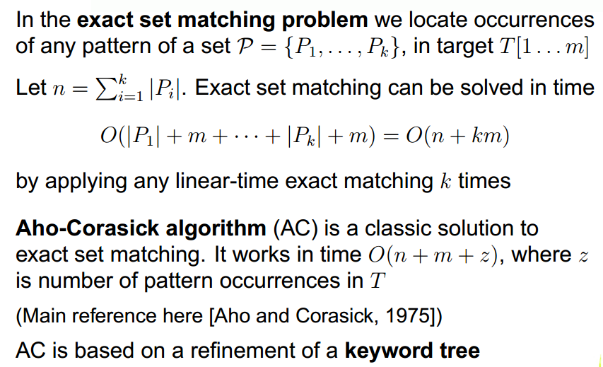
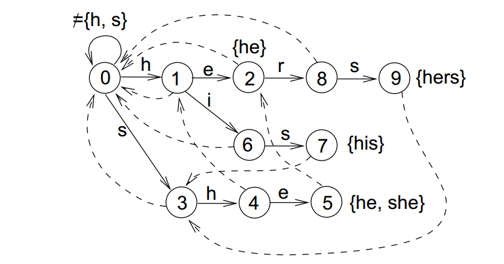
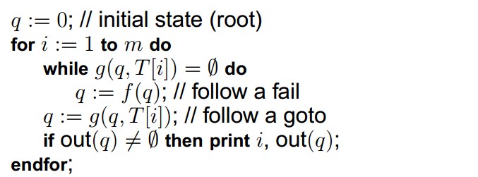
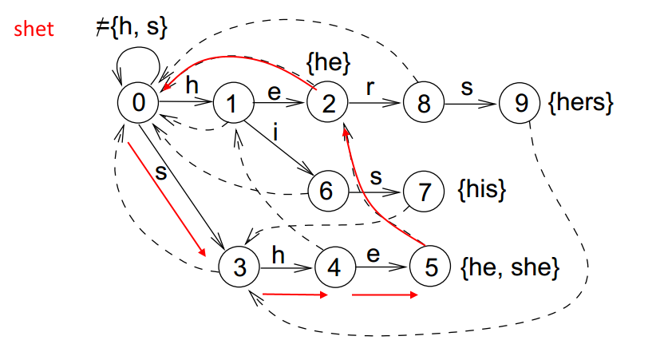
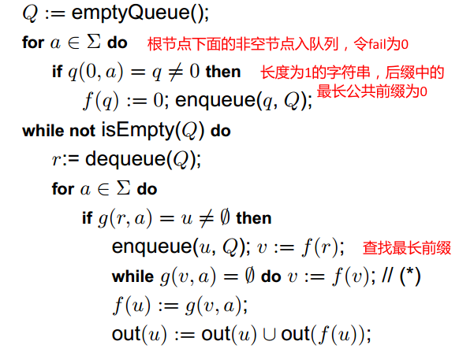
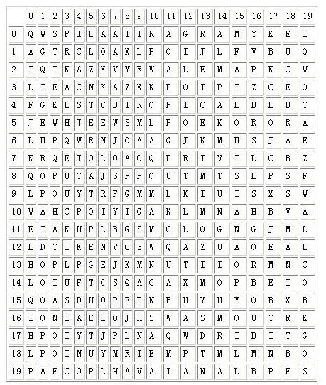

## Trie


## Trie定义

在计算机科学中，trie，又称前缀树或字典树，是一种有序树，用于保存关联数组，其中的键通常是字符串。

常用的应用：
第一：词频统计。
第二: 前缀匹配。如当输入一个网址，可以自动搜索出可能的选择。当没有完全匹配的搜索结果，可以返回前缀最相似的可能。

查找一个m长度的字符串时间复杂度为： O(m)
Trie的优点：
1. 可以方便地按字典序遍历
2. 在增加新key的时候不用更改hash函数
3. Trie中的key不存在碰撞
4. 即使在最坏的情况下，Trie仍然可以在O(m)内检索到key，m为字符串的长度。相对于Hash,由于可能存在key的碰撞，Hash最坏情况下是O(N), 最好情况是O(1)

Trie的缺点：
1. Tries在某些情况下比Hash要慢，尤其是在直接读取磁盘上的数据的时候或者在随机访问代价比较高的设备上。
2. 对于浮点数作为key的情况，会形成一个"长链",且其前缀没有语义。除非使用bit作为字母单元。
3. 有些Trie会比Hash占用更多的存储空间，因为需要对每一个字符空间，而不是像Hash那样整体处理。

## POJ3630

### Description

Given a list of phone numbers, determine if it is consistent in the sense that no number is the prefix of another. Let's say the phone catalogue listed these numbers:

Emergency 911
Alice 97 625 999
Bob 91 12 54 26
In this case, it's not possible to call Bob, because the central would direct your call to the emergency line as soon as you had dialled the first three digits of Bob's phone number. So this list would not be consistent.

### Input

The first line of input gives a single integer, 1 ≤ t ≤ 40, the number of test cases. Each test case starts with n, the number of phone numbers, on a separate line, 1 ≤ n ≤ 10000. Then follows n lines with one unique phone number on each line. A phone number is a sequence of at most ten digits.

### Output

For each test case, output "YES" if the list is consistent, or "NO" otherwise.

### Sample Input

2
3
911
97625999
91125426
5
113
12340
123440
12345
98346
### Sample Output

NO
YES

### CODE
```c++
Node nodes [65536]; //提前申请空间，防止动态申请
int global_idx;

struct Node {
	Node *next [10];
	int widx; 
	Node() :widx(0) {
		memset(next, 0, sizeof(next));
	}
};

struct Trie {
	Node tree;

	bool insert(char *word, int idx) {
		char *ptr = word;
		Node *cur = &tree;
		while (*ptr) {
			int key = *ptr - '0';
			if (!cur->next[key]) {				
				cur->next[key] = nodes + global_idx++;
			}

			//检查是否在路径上已经存在单词
			if (cur->widx && ptr + 1 != NULL) {
				return false;
			}

			cur = cur->next[key];
			ptr++;
		}

		cur->widx = idx;
		//检查是否存在以此为前缀的单词
		for (int idx = 0; idx < 10; idx++) {
			if (cur->next[idx]) {
				return false;
			}
		}

		return true;
	}
};
```

## AC自动机(Aho-Corasick Algorithm)





例如： 


## 如何构建AC自动机？


## POJ1204
### Description

Word puzzles are usually simple and very entertaining for all ages. They are so entertaining that Pizza-Hut company started using table covers with word puzzles printed on them, possibly with the intent to minimise their client's perception of any possible delay in bringing them their order. 

Even though word puzzles may be entertaining to solve by hand, they may become boring when they get very large. Computers do not yet get bored in solving tasks, therefore we thought you could devise a program to speedup (hopefully!) solution finding in such puzzles. 

The following figure illustrates the PizzaHut puzzle. The names of the pizzas to be found in the puzzle are: MARGARITA, ALEMA, BARBECUE, TROPICAL, SUPREMA, LOUISIANA, CHEESEHAM, EUROPA, HAVAIANA, CAMPONESA. 



Your task is to produce a program that given the word puzzle and words to be found in the puzzle, determines, for each word, the position of the first letter and its orientation in the puzzle. 

You can assume that the left upper corner of the puzzle is the origin, (0,0). Furthemore, the orientation of the word is marked clockwise starting with letter A for north (note: there are 8 possible directions in total). 
### Input

The first line of input consists of three positive numbers, the number of lines, 0 < L <= 1000, the number of columns, 0 < C <= 1000, and the number of words to be found, 0 < W <= 1000. The following L input lines, each one of size C characters, contain the word puzzle. Then at last the W words are input one per line.
### Output

Your program should output, for each word (using the same order as the words were input) a triplet defining the coordinates, line and column, where the first letter of the word appears, followed by a letter indicating the orientation of the word according to the rules define above. Each value in the triplet must be separated by one space only.
### Sample Input
```
20 20 10
QWSPILAATIRAGRAMYKEI
AGTRCLQAXLPOIJLFVBUQ
TQTKAZXVMRWALEMAPKCW
LIEACNKAZXKPOTPIZCEO
FGKLSTCBTROPICALBLBC
JEWHJEEWSMLPOEKORORA
LUPQWRNJOAAGJKMUSJAE
KRQEIOLOAOQPRTVILCBZ
QOPUCAJSPPOUTMTSLPSF
LPOUYTRFGMMLKIUISXSW
WAHCPOIYTGAKLMNAHBVA
EIAKHPLBGSMCLOGNGJML
LDTIKENVCSWQAZUAOEAL
HOPLPGEJKMNUTIIORMNC
LOIUFTGSQACAXMOPBEIO
QOASDHOPEPNBUYUYOBXB
IONIAELOJHSWASMOUTRK
HPOIYTJPLNAQWDRIBITG
LPOINUYMRTEMPTMLMNBO
PAFCOPLHAVAIANALBPFS
MARGARITA
ALEMA
BARBECUE
TROPICAL
SUPREMA
LOUISIANA
CHEESEHAM
EUROPA
HAVAIANA
CAMPONESA
```
### Sample Output
```
0 15 G
2 11 C
7 18 A
4 8 C
16 13 B
4 15 E
10 3 D
5 1 E
19 7 C
11 11 H
```

### CODE
```c++
struct Node {
	int next [26];
	set<int> widx; //终止节点词表
	int fail; //失败指针
	Node() :fail(-1) {
		memset(next, 0xFF, sizeof(next));
	}
};

vector<Node> nodes;
int global_idx;

inline int get_node() {
	while (global_idx >= nodes.size()) {
		nodes.push_back(Node());
	}
	return global_idx++;
}

void insert(char *word, int idx) {
	char *ptr = word;
	int cur = 0;
	while (*ptr) {
		int key = *ptr - 'A';

		if (-1 == nodes[cur].next[key]) {
			nodes[cur].next[key] = get_node();
		}

		cur = nodes[cur].next[key];
		ptr++;
	}

	nodes[cur].widx.insert(idx);
}

void build_fail() {
	queue < int > q;
	for (int idx = 0; idx < 26; idx++) {
		if (-1 != nodes[0].next[idx]) { //查找非空节点入队列，设置fail为0
			nodes[nodes[0].next[idx]].fail = 0;
			q.push(nodes[0].next[idx]);
		}
		else {
			nodes[0].next[idx] = 0; //其余情况返回根节点
		}
	}

	while (!q.empty()) {
		int cur = q.front();
		q.pop();

		for (int idx = 0; idx < 26; idx++) {
			if (-1 != nodes[cur].next[idx]) {
				int u = nodes[cur].next[idx];	//当前的下一个非空节点
				int v = nodes[cur].fail;   
				while (-1 == nodes[v].next[idx]) { //查找后缀中的最长前缀
					v = nodes[v].fail;
				}
				nodes[u].fail = nodes[v].next[idx];
				q.push(u);

				nodes[u].widx.insert(nodes[nodes[u].fail].widx.begin(),
					nodes[nodes[u].fail].widx.end());
			}
		}
	}
}


char map[1005][1005];
char dict[1005][1005];
int R, C, M;
int stepX [] = { 0, 1, 1, 1, 0, -1, -1, -1 };
int stepY [] = { -1, -1, 0, 1, 1, 1, 0, -1 };
int ans [1005] [3];
int lens [1005];

void acSearch(int y, int x, int dir) {
	int ox = stepX [dir];
	int oy = stepY [dir];
	int newX = x;
	int newY = y;
	int cur = 0;
	while(newX < C && newY < R && newX >= 0 && newY >= 0) {
		int key = map[newY][newX] - 'A';

		while (-1 == nodes[cur].next[key]) {
			cur = nodes[cur].fail;
		}

		cur = nodes[cur].next[key];

		for (set<int>::iterator p = nodes[cur].widx.begin(); p != nodes[cur].widx.end(); p++) {
			ans[*p][0] = newY - (lens[*p] - 1) * oy;
			ans[*p][1] = newX - (lens[*p] - 1) * ox;
			ans[*p][2] = dir;
		}

		newX += ox;
		newY += oy;
	}
}

int main() {
	scanf("%d%d%d", &R, &C, &M);
	
	nodes.resize(1000);
	global_idx = 1;

	for (int r = 0; r < R; r++) {
		scanf("%s", map[r]);
	}

	for (int m = 0; m < M; m++) {
		scanf("%s", dict[m]);
		lens[m] = strlen(dict[m]);
		insert(dict[m], m);
	}

	build_fail();

	for (int r = 0; r < R; r++) {
		acSearch(r, 0, 1);
		acSearch(r, 0, 2);
		acSearch(r, 0, 3);
		acSearch(r, C - 1, 5);
		acSearch(r, C - 1, 6);
		acSearch(r, C - 1, 7);
	}

	for (int c = 0; c < C; c++) {
		acSearch(0, c, 3);
		acSearch(0, c, 4);
		acSearch(0, c, 5);
		acSearch(R - 1, c, 7);
		acSearch(R - 1, c, 0);
		acSearch(R - 1, c, 1);
	}

	for (int idx = 0; idx < M; idx++) {
		printf("%d %d %c\n", ans[idx][0], ans[idx][1], (char) (ans[idx][2] + 'A'));
	}

	return 0;
}
```

### DNA repair
Time Limit: 2000MS		Memory Limit: 65536K
Total Submissions: 5882		Accepted: 2761
Description

Biologists finally invent techniques of repairing DNA that contains segments causing kinds of inherited diseases. For the sake of simplicity, a DNA is represented as a string containing characters 'A', 'G' , 'C' and 'T'. The repairing techniques are simply to change some characters to eliminate all segments causing diseases. For example, we can repair a DNA "AAGCAG" to "AGGCAC" to eliminate the initial causing disease segments "AAG", "AGC" and "CAG" by changing two characters. Note that the repaired DNA can still contain only characters 'A', 'G', 'C' and 'T'.

You are to help the biologists to repair a DNA by changing least number of characters.

### Input

The input consists of multiple test cases. Each test case starts with a line containing one integers N (1 ≤ N ≤ 50), which is the number of DNA segments causing inherited diseases.
The following N lines gives N non-empty strings of length not greater than 20 containing only characters in "AGCT", which are the DNA segments causing inherited disease.
The last line of the test case is a non-empty string of length not greater than 1000 containing only characters in "AGCT", which is the DNA to be repaired.
The last test case is followed by a line containing one zeros.


### Output

For each test case, print a line containing the test case number( beginning with 1) followed by the
number of characters which need to be changed. If it's impossible to repair the given DNA, print -1.
### Sample Input

2
AAA
AAG
AAAG    
2
A
TG
TGAATG
4
A
G
C
T
AGT
0
### Sample Output

Case 1: 1
Case 2: 4
Case 3: -1

### 思路
DP+AC自动机。多串的匹配，自然先联系到AC自动机。其次也符合DP的最优子结构思想，难就难在DP状态的确定上面了。这里将AC自动机上每一个节点作为一个状态，则dp[i][j]表示自串为0~i，状态为自动机上j节点时最少改变的字符数。状态转移方程为：dp[i][son[j]]= min{ dp[i][son[j]], dp[i-1][j]+(tran[j][son[j]] != str[i] )}，其中tran[j][son[j]]表示有从j到son[j]经过的字母边。

理解： 本题的搜索空间是4^N,也就是一个四个节点的搜索树，最暴力的方法是找出这颗搜索树中每一个从根到叶子节点且不存在致病基因，且代价最小的路径。明显的，4^N的搜索空间太大了，需要DP。DP的过程是一边枚举搜索树，一边更新AC自动机的状态(也就是AC自动机的匹配过程)。这里在某一个dp[i][j]状态更改代价后并不会影响后面的状态，因为带字符串到i位置，状态到j时，假设已经找到dp[i][j]的最小代价，下面的枚举从这个状态继续运行即可。无论通过何路径到达dp[i][j]，后面的枚举产生的新代价均不会对之前有任何影响，前面的代价也不会对后面有任何影响。
### CODE
```c++
#include <string>
#include <cstring>
#include <cfloat>
#include <iostream>
#include <cstdio>
#include <algorithm>
#include <vector>
#include <queue>
#include <set>
using namespace std;

#define inf 0x7FFFFFFF

inline int getIdx(char c) {
	int v = 0;
	switch (c) {
	case 'A': v = 0; break;
	case 'G': v = 1; break;
	case 'C': v = 2; break;
	case 'T': v = 3; break;
	}
	return v;
}

struct Node {
	int next[4];
	int widx;
	int fail;
	Node() :fail(-1), widx(-1) {
		memset(next, 0xFF, sizeof(next));
	}
};

vector<Node> nodes;
int global_idx;

inline int get_node() {
	while (global_idx >= nodes.size()) {
		nodes.push_back(Node());
	}
	return global_idx++;
}

void insert(char *word, int idx) {
	char *ptr = word;
	int cur = 0;
	while (*ptr) {
		int key = getIdx(*ptr);

		if (-1 == nodes[cur].next[key]) {
			nodes[cur].next[key] = get_node();
		}

		cur = nodes[cur].next[key];
		ptr++;
	}

	nodes[cur].widx = idx;
}

void build_fail() {
	queue < int > q;
	//nodes[0].fail = 0;
	for (int idx = 0; idx < 4; idx++) {
		if (-1 != nodes[0].next[idx]) {
			nodes[nodes[0].next[idx]].fail = 0;
			q.push(nodes[0].next[idx]);
		}
		else {
			nodes[0].next[idx] = 0;
		}
	}

	while (!q.empty()) {
		int cur = q.front();
		q.pop();

		for (int idx = 0; idx < 4; idx++) {
			if (-1 != nodes[cur].next[idx]) {
				int u = nodes[cur].next[idx];
				int v = nodes[cur].fail;
				while (-1 == nodes[v].next[idx]) {
					v = nodes[v].fail;
				}
				nodes[u].fail = nodes[v].next[idx];
				if (nodes[u].widx == -1 && nodes[nodes[u].fail].widx != -1) {
					nodes[u].widx = nodes[nodes[u].fail].widx;
				}
				q.push(u);
			}
		}
	}
}

int Case;
int N;
char word[50][24];
char dna[1005];
int dp[1005][1005];
int text_len;
int main() {
	Case = 1;
	nodes.resize(1000);

	while (scanf("%d", &N) != EOF && N) {
		global_idx = 1;
		memset(&nodes[0], 0xFF, sizeof(Node) * nodes.size());

		for (int y = 0; y < 1005; y++) {
			for (int x = 0; x < 1005; x++) {
				dp[y][x] = inf;
			}
		}
		dp[0][0] = 0;

		for (int idx = 0; idx < N; idx++) {
			scanf("%s", word[idx]);
			insert(word[idx], idx);
		}

		build_fail();

		scanf("%s", dna);
		text_len = strlen(dna);

		for (int idx = 1; idx <= text_len; idx++) {
			for (int jdx = 0; jdx < global_idx; jdx++) {
				if (dp[idx - 1][jdx] != inf) {
					for (int z = 0; z < 4; z++) {
						int T = z != getIdx(dna[idx - 1]);
						int u, v = jdx;
						if (-1 == nodes[v].next[z]) {
							v = nodes[jdx].fail;
							while (-1 == nodes[v].next[z]) {
								v = nodes[v].fail;
							}
						}

						u = nodes[v].next[z];
						if (nodes[u].widx != -1) {
							continue;
						}
						dp[idx][u] = min(dp[idx][u], dp[idx - 1][jdx] + T);
					}
				}
			}
		}

		int ans = inf;
		for (int idx = 0; idx < global_idx; idx++) {
			ans = min(ans, dp[text_len][idx]);
		}

		printf("Case %d: ", Case++);
		if (ans == inf) printf("-1\n");
		else printf("%d\n", ans);
	}
	return 0;
}
```

## The Cow Lexicon
Time Limit: 2000MS		Memory Limit: 65536K
Total Submissions: 8621		Accepted: 4071
### Description

Few know that the cows have their own dictionary with W (1 ≤ W ≤ 600) words, each containing no more 25 of the characters 'a'..'z'. Their cowmunication system, based on mooing, is not very accurate; sometimes they hear words that do not make any sense. For instance, Bessie once received a message that said "browndcodw". As it turns out, the intended message was "browncow" and the two letter "d"s were noise from other parts of the barnyard.

The cows want you to help them decipher a received message (also containing only characters in the range 'a'..'z') of length L (2 ≤ L ≤ 300) characters that is a bit garbled. In particular, they know that the message has some extra letters, and they want you to determine the smallest number of letters that must be removed to make the message a sequence of words from the dictionary.

### Input

Line 1: Two space-separated integers, respectively: W and L 
Line 2: L characters (followed by a newline, of course): the received message 
Lines 3..W+2: The cows' dictionary, one word per line
### Output

Line 1: a single integer that is the smallest number of characters that need to be removed to make the message a sequence of dictionary words.
### Sample Input
```
6 10
browndcodw
cow
milk
white
black
brown
farmer
```
### Sample Output
```
2
```