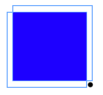

# Week 8 Problems(DP)


## [Unique Paths 2](https://leetcode.com/problems/unique-paths/)
### Description

A robot is located at the top-left corner of a m x n grid (marked 'Start' in the diagram below).

The robot can only move either down or right at any point in time. The robot is trying to reach the bottom-right corner of the grid (marked 'Finish' in the diagram below).
How many possible unique paths are there?
Now consider if some obstacles are added to the grids. How many unique paths would there be?
An obstacle and empty space is marked as 1 and 0 respectively in the grid.
For example,
There is one obstacle in the middle of a 3x3 grid as illustrated below.
```
[
  [0,0,0],
  [0,1,0],
  [0,0,0]
]
``` 

### Code Template
```C++
class Solution {
	int h, w;
	vector<vector<int>> count;
	
public:
	int uniquePathsWithObstacles(vector<vector<int>>& obstacleGrid)  {
	}
}
```

### 思路

```python
if obstacleGrid[y][x] == 0:
	DP[y][x] = DP[y - 1][x] +　DP[y][x - 1]
else:
	DP[y][x] = 0
```

### CODE
```c++
class Solution {
public:
	int uniquePathsWithObstacles(vector<vector<int>>& obstacleGrid) {
		int h = obstacleGrid.size();
		int w = obstacleGrid[0].size();
		vector<int> dp(w, 0);
		if (obstacleGrid[0][0]) return 0;
		dp[0] = 1;

		for (int y = 0; y < h; y++) {
			for (int x = 0; x < w; x++) {
				if (obstacleGrid[y][x] == 1) {
					dp[x] = 0;
				}
				else if (x > 0) {
					dp[x] += dp[x - 1]; 
				}
			}
		}

		return dp [w - 1];
	}
};
```
 
## [Best Time to Buy and Sell Stock](https://leetcode.com/problems/best-time-to-buy-and-sell-stock/)

### Description
Say you have an array for which the ith element is the price of a given stock on day i.

If you were only permitted to complete at most one transaction (ie, buy one and sell one share of the stock), design an algorithm to find the maximum profit.

### Code Template
```c++
class Solution {
public:
    int maxProfit(vector<int>& prices) {
    }
};
```

### 思路1
在每一个时间点i计算当前价格和之前最小价格的差，取最大的作为结果。
dp[i+1] = max{dp[i], prices[i+1] - minprices}

### Code
```c++
class Solution {
public:
    int maxProfit(vector<int>& prices) {
        if(!prices.size()) return 0;
        int curmin = prices[0];
        int n = prices.size();
        int max_profit = 0;
        for(int idx = 1;idx < n;idx++) {
            if(curmin < prices[idx]) {
				max_profit = max(prices[idx] - curmin, max_profit);
            } else {
                curmin = prices[idx];
            }
        }
        return max_profit;
    }
};
```

### 思路2
按照股票差价构成新数组 prices[1]-prices[0], prices[2]-prices[1], prices[3]-prices[2], ..., prices[n-1]-prices[n-2]， 并找到该数组的最大连续子段和

### Code
```c++
class Solution {
public:
    int maxProfit(vector<int> &prices) {
        // IMPORTANT: Please reset any member data you declared, as
        // the same Solution instance will be reused for each test case.
        int len = prices.size();
        if(len <= 1)return 0;
        int res = 0, currsum = 0;
        for(int i = 1; i < len; i++)
        {
            if(currsum <= 0)
                currsum = prices[i] - prices[i-1];
            else
                currsum += prices[i] - prices[i-1];
            if(currsum > res)
                res = currsum;
        }
        return res;
    }
};
```

## Best Time to Buy and Sell Stock II
Say you have an array for which the ith element is the price of a given stock on day i.

Design an algorithm to find the maximum profit. You may complete as many transactions as you like (ie, buy one and sell one share of the stock multiple times). However, you may not engage in multiple transactions at the same time (ie, you must sell the stock before you buy again).

用一个数组表示股票每天的价格，数组的第i个数表示股票在第i天的价格。交易次数不限，但一次只能交易一支股票，也就是说手上最多只能持有一支股票，求最大收益。

### 思路
贪心法。从前向后遍历数组，只要当天的价格高于前一天的价格，就算入收益。

### Code
```c++
class Solution {
public:
    int maxProfit(vector<int>& prices) {
        if (prices.size() < 2) return 0;
        
        int maxProfit = 0;
        for (int i = 1; i < prices.size(); i++) {
            int diff = prices[i] - prices[i - 1];
            if (diff > 0) {
                maxProfit += diff;
            }
        }
        
        return maxProfit;
    }
};
```
 

## [Best Time to Buy and Sell Stock III](https://leetcode.com/problems/best-time-to-buy-and-sell-stock-iii/)
Say you have an array for which the ith element is the price of a given stock on day i.

Design an algorithm to find the maximum profit. You may complete at most two transactions.
用一个数组表示股票每天的价格，数组的第i个数表示股票在第i天的价格。最多交易两次，手上最多只能持有一支股票，求最大收益。

### 思路
这一题约束最多只能买卖两次股票，并且手上最多也只能持有一支股票。因为不能连续买入两次股票，所以买卖两次肯定分布在前后两个不同的区间。
设`p(i) = 区间[0,1,2...i]的最大利润 + 区间[i,i+1,....n-1]的最大利润`（式子中两个区间内分别只能有一次买卖，这就是第一道题的问题），那么本题的最大利润 = `max{p[0],p[1],p[2],...,p[n-1]}`。根据上一题的解法，我们可以求区间[0,1,2...i]的最大利润；同理可以从后往前扫描数组求区间[i,i+1,....n-1]的最大利润

### Code
```c++
class Solution {
public:
	int maxProfit(vector<int>& prices) {
		if (!prices.size()) return 0;
		int len = prices.size();
		int max_profit = 0, min_price = prices[0], max_price = prices[len - 1];
		vector<int> max_profit_head(len);
		max_profit_head[0] = 0;
		for (int idx = 1; idx < len; idx++) {
			if (prices[idx] > min_price) {
				max_profit_head[idx] = max(max_profit_head[idx - 1], prices[idx] - min_price);
			}
			else {
				min_price = prices[idx];
			}
		}

		max_profit = max_profit_head[len - 1];

		int max_profit_tail = 0;
		for (int idx = len - 2; idx >= 0; idx--) {
			if (prices[idx] < max_price) {
				max_profit_tail = max(max_profit_tail, max_price - prices[idx]);
			}
			else {
				max_price = prices[idx];
			}
			if (max_profit_tail + max_profit_head[idx] > max_profit) {
				max_profit = max_profit_tail + max_profit_head[idx];
			}
		}
		return max_profit;
	}
};
```

## [Best Time to Buy and Sell Stock IV](https://leetcode.com/problems/best-time-to-buy-and-sell-stock-iv/)
Say you have an array for which the ith element is the price of a given stock on day i.

Design an algorithm to find the maximum profit. You may complete at most k transactions.

### 思路

特殊动态规划法。传统的动态规划我们会这样想，到第i天时进行j次交易的最大收益，要么等于到第i-1天时进行j次交易的最大收益（第i天价格低于第i-1天的价格），要么等于到第i-1天时进行j-1次交易，然后第i天进行一次交易（第i天价格高于第i-1天价格时）。于是得到动规方程如下（其中diff = prices[i] – prices[i – 1]）：

`profit[i][j] = max(profit[i – 1][j], profit[i – 1][j – 1] + diff)`

看起来很有道理，但其实不对，为什么不对呢？因为diff是第i天和第i-1天的差额收益，如果第i-1天当天本身也有交易呢，那么这两次交易就可以合为一次交易，这样profit[i – 1][j – 1] + diff实际上只进行了j-1次交易，而不是最多可以的j次，这样得到的最大收益就小了。

那么怎样计算第i天进行交易的情况的最大收益，才会避免少计算一次交易呢？我们用一个局部最优解和全局最有解表示到第i天进行j次的收益，这就是该动态规划的特殊之处。

用local[i][j]表示到达第i天时，最多进行j次交易的局部最优解；用global[i][j]表示到达第i天时，最多进行j次的全局最优解。它们二者的关系如下（其中diff = prices[i] – prices[i – 1]）：

```
local[i][j] = max(global[i – 1][j – 1] + max(diff, 0), local[i – 1][j] + diff)
global[i][j] = max(global[i – 1][j], local[i][j])
```

其中的local[i – 1][j] + diff就是为了避免第i天交易和第i-1天交易合并成一次交易而少一次交易收益。

### Code
```c++
class Solution {
public:
    int maxProfit(int k, vector<int>& prices) {
        if (prices.size() < 2) return 0;
        if (k >= prices.size()) return maxProfit2(prices);
        
        vector<int> local(k + 1);
        vector<int> global(k + 1);
                
        for (int i = 1; i < prices.size(); i++) {
            int diff = prices[i] - prices[i - 1];
            for (int j = k; j > 0; j--) {
                local[j] = max(global[j - 1] + max(diff, 0), local[j] + diff);
                global[j] = max(global[j], local[j]);
            }
        }
        
        return global[k];
    }
    
    
    int maxProfit2(vector<int>& prices) {
        if (prices.size() < 2) return 0;
        
        int maxProfit = 0;
        for (int i = 1; i < prices.size(); i++) {
            int diff = prices[i] - prices[i - 1];
            if (diff > 0) {
                maxProfit += diff;
            }
        }
        
        return maxProfit;
    }
};
```


## House Robber
You are a professional robber planning to rob houses along a street. Each house has a certain amount of money stashed, the only constraint stopping you from robbing each of them is that adjacent houses have security system connected and it will automatically contact the police if two adjacent houses were broken into on the same night.

Given a list of non-negative integers representing the amount of money of each house, determine the maximum amount of money you can rob tonight without alerting the police.

### 状态转移
F[idx] = max(F[idx - 1], F[idx - 2] + nums[idx]) if idx >= 2
F[idx] = max(nums[idx], nums[idx - 1]) if idx == 1
F[idx] = nums[idx] if idx == 0


### Code
```c++
class Solution {
public:
	int rob(vector<int>& nums) {
		if (!nums.size()) return 0;
		if (1 == nums.size()) return nums[0];
		vector<int> moneys(nums.size());
		moneys[0] = nums[0];
		moneys[1] = max(nums[0], nums[1]);
		for (int idx = 2; idx < nums.size(); idx++) {
			moneys[idx] = max(moneys[idx - 1], moneys[idx - 2] + nums[idx]);
		}
		return moneys [nums.size() - 1];
	}
};
```

## House Rober 2
After robbing those houses on that street, the thief has found himself a new place for his thievery so that he will not get too much attention. This time, all houses at this place are arranged in a circle. That means the first house is the neighbor of the last one. Meanwhile, the security system for these houses remain the same as for those in the previous street.

Given a list of non-negative integers representing the amount of money of each house, determine the maximum amount of money you can rob tonight without alerting the police.

### 分析
这次的房子呈环形，因此第一个和最后一个无法同时选择。
假设房屋数量为N， 若选择1号房间，则最大的抢劫钱数等价于F(1...N-1), 否则，最大抢劫钱数等价于F(2....N),
即F_circle(1:N) = max(F(1:N-1), F(2:N))

### Code
```c++
class Solution {
public:
	int process(int *nums, int len) {
		if (!len) return 0;
		if (1 == len) return nums[0];
		vector<int> moneys(len);
		moneys[0] = nums[0];
		moneys[1] = max(nums[0], nums[1]);
		for (int idx = 2; idx < len; idx++) {
			moneys[idx] = max(moneys[idx - 1], moneys[idx - 2] + nums[idx]);
		}
		return moneys[len - 1];
	}

	int rob(vector<int>& nums) {
		int len = nums.size();
		if (!len) return 0;
		if (len == 1) return nums[0];
		return max(process(&nums[0], len - 1), process(&nums[0] + 1, len - 1));
	}
};
```

## Minimum Path Sum
Given a m x n grid filled with non-negative numbers, find a path from top left to bottom right which minimizes the sum of all numbers along its path.

### 状态转移方程
`F[Y][X] = min(F[Y-1][X], F[Y][X - 1])`

### Code
```c++
class Solution {
public:
    int minPathSum(vector<vector<int>>& grid) {
        int M = grid.size(), N = grid[0].size();
        vector<int> distance(N);
        distance[0] = grid[0][0];
        for(int idx = 1;idx < N;idx++) {
            distance[idx] = grid[0][idx] + distance[idx - 1];
        }
        for(int y = 1;y < M;y++) {
            for(int x = 0;x < N;x++) {
                if (x > 0) {
                    distance[x] = min(distance[x - 1], distance[x]) + grid[y][x];
                } else {
                    distance[x] += grid[y][x];
                }
            }
        }
        return distance[N - 1];
    }
};
```

## Maximum Subarray
Find the contiguous subarray within an array (containing at least one number) which has the largest sum.

For example, given the array [−2,1,−3,4,−1,2,1,−5,4],
the contiguous subarray [4,−1,2,1] has the largest sum = 6.

### 状态转移方程
F[x] = max(F[x - 1] + nums[x], nums[x])
需要记录当前是否是最大值。

这是一道非常经典的动态规划的题目，用到的思路我们在别的动态规划题目中也很常用，以后我们称为”局部最优和全局最优解法“。
基本思路是这样的，在每一步，我们维护两个变量，一个是全局最优，就是到当前元素为止最优的解是，一个是局部最优，就是必须包含当前元素的最优的解。接下来说说动态规划的递推式（这是动态规划最重要的步骤，递归式出来了，基本上代码框架也就出来了）。假设我们已知第i步的global[i]（全局最优）和local[i]（局部最优），那么第i+1步的表达式是：
local[i+1]=Math.max(A[i], local[i]+A[i])，就是局部最优是一定要包含当前元素，所以不然就是上一步的局部最优local[i]+当前元素A[i]（因为local[i]一定包含第i个元素，所以不违反条件），但是如果local[i]是负的，那么加上他就不如不需要的，所以不然就是直接用A[i]；
global[i+1]=Math(local[i+1],global[i])，有了当前一步的局部最优，那么全局最优就是当前的局部最优或者还是原来的全局最优（所有情况都会被涵盖进来，因为最优的解如果不包含当前元素，那么前面会被维护在全局最优里面，如果包含当前元素，那么就是这个局部最优）。
### Code
```c++
class Solution {
public:
    int maxSubArray(vector<int>& nums) {
        int maxsum = nums[0];
        int pre = nums[0];
        for(int idx = 1;idx < nums.size();idx++) {
            pre = max(pre + nums[idx], nums[idx]);
            maxsum = max(maxsum, pre);
        }
        
        return maxsum;
    }
};
```

## Maximum Product Subarray 
Find the contiguous subarray within an array (containing at least one number) which has the largest product.

For example, given the array [2,3,-2,4],
the contiguous subarray [2,3] has the largest product = 6.

### 思路
这个题目与上一个题目在于乘法中负负得正，因此此题目需要记录一下极小值。
状态转移方程：
F_max[X] = max(nums[x], F_max[x - 1] * nums[x], F_min[x - 1] * nums[x])
F_min[X] = min(nums[x], F_max[x - 1] * nums[x], F_min[x - 1] * nums[x])


### Code
```c++
class Solution {
public:
    int maxProduct(vector<int>& nums) {
        vector<int> maxs(nums.size());
        vector<int> mins(nums.size());
        maxs[0] = mins[0] = nums[0];
        int resmax = nums[0];
        for(int idx = 1; idx < nums.size();idx++) {
            int cur = nums[idx];
            maxs[idx] = max(cur, max(cur * maxs[idx - 1], cur * mins[idx - 1]));
            mins[idx] = min(cur, min(cur * maxs[idx - 1], cur * mins[idx - 1]));
            resmax = max(maxs[idx], resmax);
        }
        return resmax;
    }
};

```

## Maximal Square 
Given a 2D binary matrix filled with 0's and 1's, find the largest square containing all 1's and return its area.

For example, given the following matrix:

```
1 0 1 0 0
1 0 1 1 1
1 1 1 1 1
1 0 0 1 0
```
Return 4.

### 状态转移方程
dp[y][x]为右下角坐标为(x,y)的正方形的长度
```python
dp[y][x] = min(dp[y-1][x], dp[x-1][y], dp[x-1][y-1]) + 1 if matrix[y][x] == 1
dp[y][x] = 0 if matrix[y][x] == 0
```


### Code
```c++
class Solution {
public:
    int maximalSquare(vector<vector<char>>& matrix) {
        if(!matrix.size()) return 0;
        int M = matrix.size(), N = matrix[0].size();
        vector<vector<int>> dp(M);
        for(int idx = 0;idx < M;idx++) {
            dp[idx].resize(N);
        }
        
        int max_len = 0;
        
        for(int y = 0;y < M;y++) {
            for(int x = 0;x < N;x++) {
                dp[y][x] = matrix[y][x] - '0';
                if(x > 0 && y > 0 && dp[y][x]) {
                    dp[y][x] = min(dp[y - 1][x - 1], min(dp[y][x - 1], dp[y - 1][x])) + 1;    
                }
                max_len = max(max_len, dp[y][x]);
            }
        }
        return max_len * max_len;
    }
};

```

## Maximal Rectangle 
Given a 2D binary matrix filled with 0's and 1's, find the largest rectangle containing all ones and return its area.

### 思路1
把矩阵分成好多层，每一层看成一个直方图，那么这个问题转化为多个计算直方图中最大矩形的问题。


### CODE
```c++
class Solution {
public:
    int maximalRectangle(vector<vector<char>>& matrix) {
        if(!matrix.size()) return 0;
        int M = matrix.size(), N = matrix[0].size();
        int res_area = 0;
        vector<int> height(N, 0);
        for(int y = 0;y < M;y++) {
            for(int x = 0;x < N;x++) {
                height[x] = matrix[y][x] - '0' ? height[x] + 1 : 0;
            }
            res_area = max(res_area, largestRectangleArea(height));
        }
        return res_area;
    }
    
    int largestRectangleArea(vector<int> height) {
        height.push_back(0);
        stack<int> s;
        s.push(0);
        int max_area = height[0];

        for(int idx = 1;idx < height.size();idx++) {
            if (height[idx] >= height[s.top()]) {
                s.push(idx);
            } else {
                while(s.size() && height[s.top()] > height[idx]) {
                    int last_pos = s.top(), cur_area;
                    s.pop();
                    if(s.size()) {
                        cur_area = height[last_pos] * (idx - s.top() - 1);
                    } else {
                        cur_area = height[last_pos] * idx;
                    }
                    max_area = max(cur_area, max_area);
                }
                s.push(idx);
            }               
        }
        return max_area;
    }
};
```

### 思路2
先用统计matrix[y][x]处当前行以(x, y)为结尾的1的长度，然后遍历整个矩阵。

### Code
```c++
class Solution {
public:
	int maximalRectangle(vector<vector<char>>& matrix) {
		if (matrix.size() == 0)
			return 0;
		int res = 0;
		int m = matrix.size(), n = matrix[0].size();
		vector<vector<int>> dp(m);
		for (int idx = 0; idx < m; idx++) {
			dp[idx].resize(n, 0);
		}

		for (int i = 0; i < m; i++) {
			dp[i][0] = matrix[i][0] - '0';
			for (int j = 1; j < n; j++) {
				dp[i][j] = matrix[i][j] == '1' ? dp[i][j - 1] + 1 : 0;
			}
		}
		for (int i = 0; i < m; i++) {
			for (int j = 0; j < n; j++) {
				res = max(res, expand(dp, i, j));
			}
		}
		return res;
	}

	int expand(vector<vector<int>>& dp, int I, int J) {
		int height = 0;
		int width = dp[I][J];
		//go up
		for (int i = I - 1; i >= 0; i--) {
			if (dp[i][J] >= width) 
				height++;
			else 
				break;
		}
		//go down
		for (int i = I; i < dp.size(); i++) {
			if (dp[i][J] >= width) 
				height++;
			else 
				break;
		}
		return width * height;
	}
};
```


